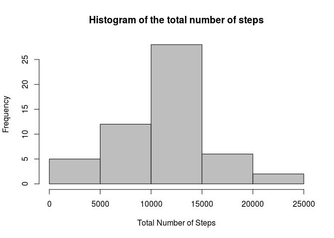
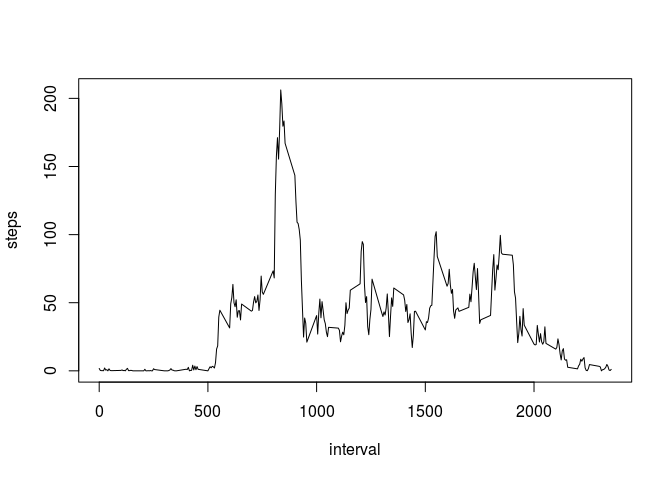
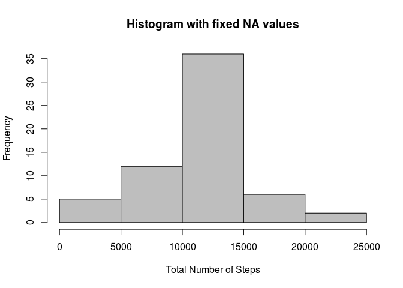
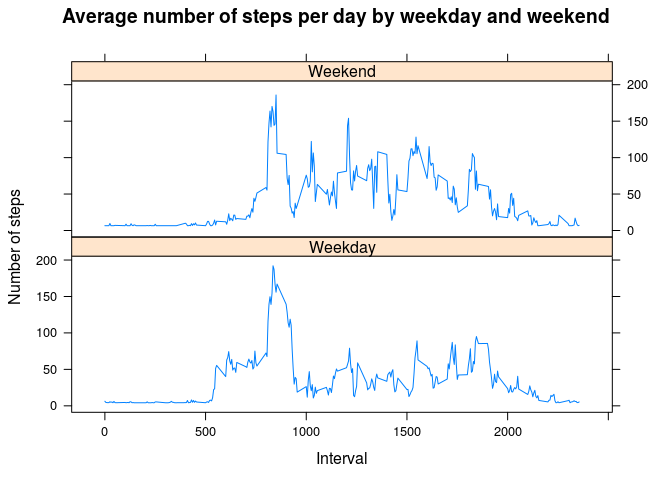

# Reproducible Research: Peer Assessment 1


## Loading and preprocessing the data

This code downlaods the file from the URL and stores it in the temporary
file locally. Consecutivelly, it reads the unzipped data from the file to
the data frame `sourceData`.


```r
fileUrl <- "https://d396qusza40orc.cloudfront.net/repdata%2Fdata%2Factivity.zip"
temp <- tempfile()  # creates temporary file where zip will be stored
download.file(url = fileUrl, destfile = temp, method = "curl")  
sourceData <- read.csv(unzip(zipfile = temp), stringsAsFactors = FALSE)
unlink("activity.csv")  # remove unnecessary file after data frame is loaded
remove(fileUrl, temp)   # remove unnecessary data objects
str(sourceData)
```

```
## 'data.frame':	17568 obs. of  3 variables:
##  $ steps   : int  NA NA NA NA NA NA NA NA NA NA ...
##  $ date    : chr  "2012-10-01" "2012-10-01" "2012-10-01" "2012-10-01" ...
##  $ interval: int  0 5 10 15 20 25 30 35 40 45 ...
```

By using `stringAsFactors = FALSE` argument in `read.csv()` we avoided interpreting
*date* variable as factor. Though, we still want to convert character class  of the
variable to its proper date class.


```r
sourceData$date <- as.Date(sourceData$date)
str(sourceData)
```

```
## 'data.frame':	17568 obs. of  3 variables:
##  $ steps   : int  NA NA NA NA NA NA NA NA NA NA ...
##  $ date    : Date, format: "2012-10-01" "2012-10-01" ...
##  $ interval: int  0 5 10 15 20 25 30 35 40 45 ...
```

Now we have the right classes of the variables in place.  
  
  
## What is mean total number of steps taken per day?

We want to create a histogram of the total number of steps taken each day


```r
library(plyr)   # This package enables easy splitting and combining data
histogramData <- aggregate(steps ~ date, data = sourceData, FUN = sum) # sum steps per day
str(histogramData)
```

```
## 'data.frame':	53 obs. of  2 variables:
##  $ date : Date, format: "2012-10-02" "2012-10-03" ...
##  $ steps: int  126 11352 12116 13294 15420 11015 12811 9900 10304 17382 ...
```

Data is ready, let's now plot the histogram of the total steps taken each day.


```r
hist(histogramData$steps, main = "Histogram of the total number of steps", 
     xlab = "Total Number of Steps", col = "grey")
```

<!-- -->

Now report on mean and median of the set:


```r
# Mean
mean(histogramData$steps)
```

```
## [1] 10766.19
```

```r
#Median
median(histogramData$steps)
```

```
## [1] 10765
```


## What is the average daily activity pattern?

*Make a time series plot (i.e. type = "l") of the 5-minute interval (x-axis) and the average number of steps taken, averaged across all days (y-axis).*

For time series plot, we will need a data frame that aggregates steps over interval and
calculates mean. We will use `aggregate()` function from `plyr` package (already sourced above).


```r
ts.data <- aggregate(steps ~ interval, data = sourceData, FUN = mean, na.action = na.omit)
plot(ts.data, type = "l") # Create time-series plot of "l" type
```

<!-- -->

*Which 5-minute interval, on average across all the days in the dataset, contains the maximum number of steps?*


```r
max.steps <- which.max(ts.data$steps)   # position of the maximum step interval
max.interval <- ts.data[max.steps, "interval"] # interval beside max.steps value
```

The maximum number of steps on average is contained in the **835** interval.


## Imputing missing values

*1. Calculate and report the total number of missing values in the dataset (i.e. the total number of rows with NAs).*


```r
missingValues <- length(which(is.na(sourceData$steps)))
```

There are 2304 NA values in the dataset.

*2. Devise a strategy for filling in all of the missing values in the dataset.*

I will use `mean` of the whole set of steps to populate missing values.

*3. Create a new dataset that is equal to the original dataset but with the missing data filled in.*


```r
intervalAverage <- mean(sourceData$steps, na.rm = TRUE) # mean of the steps column
steps.vector <- sourceData$steps    # cut off steps as a vector to manipulate with it
na.vector <- which(is.na(sourceData$steps)) # identify which positions (rows) are NAs
steps.vector[na.vector] <- intervalAverage  # replace NA values with the mean
sourceFix <- cbind("steps" = steps.vector, sourceData[, 2:3])   # create data frame
str(sourceFix)  
```

```
## 'data.frame':	17568 obs. of  3 variables:
##  $ steps   : num  37.4 37.4 37.4 37.4 37.4 ...
##  $ date    : Date, format: "2012-10-01" "2012-10-01" ...
##  $ interval: int  0 5 10 15 20 25 30 35 40 45 ...
```

We have created a new data frame `sourceFix`. NA values have been replaced with the mean of the steps in the dataset.  


*4.1. Make a histogram of the total number of steps taken each day and Calculate and report the mean and median total number of steps taken per day.*


```r
histogramFix <- aggregate(steps ~ date, data = sourceFix, FUN = sum) # new histogram data
hist(histogramFix$steps, main = "Histogram with fixed NA values", 
     xlab = "Total Number of Steps", col = "grey")  # plot new histogram
```

<!-- -->

Report on mean and median of the set. Prepare the code:


```r
library(xtable) # package to output tables in HTML and LATEX
meanFix <- mean(histogramFix$steps) # calculate mean
medianFix <- median(histogramFix$steps) # calculate median
xt.df <- data.frame("Value" = c(meanFix, medianFix), row.names = c("Mean", "Median"))   # Create data frame, because 'xtable' needs it to conver to xtable format
xt <- xtable(xt.df) # conver to xtable format
```

Print the report table:  


```r
print(xt, type = "html")    # To print table in HTML, results = "asis" needs to be set
```

<!-- html table generated in R 3.3.1 by xtable 1.8-2 package -->
<!-- Sat Mar 25 21:52:46 2017 -->
<table border=1>
<tr> <th>  </th> <th> Value </th>  </tr>
  <tr> <td align="right"> Mean </td> <td align="right"> 10766.19 </td> </tr>
  <tr> <td align="right"> Median </td> <td align="right"> 10766.19 </td> </tr>
   </table>
  
*4.2. Do these values differ from the estimates from the first part of the assignment? What is the impact of imputing missing data on the estimates of the total daily number of steps?*

The mean is the same as in the first part of the assignment, the median is now
equal to the mean, while it was slightly lower in the first case. The reason for this is 
replacing NA values for the mean. While it only confirms mean with no effect to the value, 
the effect of the median is obvious: median is supposed to fit in the middle of the 
whole data set. By putting more values in, the distribution of values technically changed.


## Are there differences in activity patterns between weekdays and weekends?

*1. Create a new factor variable in the dataset with two levels – “weekday” and “weekend” indicating whether a given date is a weekday or weekend day.*


```r
library(lubridate)  # package to deal with dates: leverage wday() function
# save date columns as a vector to manipulate with wday() returns 1-7 for Sunday - Saturday weekdays
wf <- wday(sourceFix$date)  
# replaces Saturday and Sunday for "Weekend" while coerce the vector to character
wf <- replace(wf, which(wf == 6 | wf == 1), "Weekend")  
# The rest of values that are not "Weekend" are assumed as "Weekday"
wf <- replace(wf, which(wf != "Weekend"), "Weekday") 
wf <- as.factor(wf)   # convert character vector to factor
sourceFix[, "weekpart"] <- wf   # add factors to data frame as a new column
str(sourceFix)
```

```
## 'data.frame':	17568 obs. of  4 variables:
##  $ steps   : num  37.4 37.4 37.4 37.4 37.4 ...
##  $ date    : Date, format: "2012-10-01" "2012-10-01" ...
##  $ interval: int  0 5 10 15 20 25 30 35 40 45 ...
##  $ weekpart: Factor w/ 2 levels "Weekday","Weekend": 1 1 1 1 1 1 1 1 1 1 ...
```


*2. Make a panel plot containing a time series plot (i.e. type = "l") of the 5-minute interval (x-axis) and the average number of steps taken, averaged across all weekday days or weekend days (y-axis).*  

We will prepare data frame suitable for the panel plot by aggregating "Weekdays" and "Weekends" separately and joining them together. We will plot the graph from aggregated data.


```r
sub.weekend <- which(sourceFix$weekpart == "Weekend")   # identify rows with "Weekend" dates
sub.weekday <- which(sourceFix$weekpart == "Weekday")   # identify rows with "Weekday" dates
# Create 2 time series tables separately for Weekday and Weekend; aggregate steps mean over invervals
ts.weekend <- aggregate(steps ~ interval + weekpart, data = sourceFix, FUN = mean, subset = sub.weekend)
ts.weekday <- aggregate(steps ~ interval + weekpart, data = sourceFix, FUN = mean, subset = sub.weekday)
# join 2 time seried tables in one data frame
panelData <- rbind(ts.weekday, ts.weekend)
str(panelData)
```

```
## 'data.frame':	576 obs. of  3 variables:
##  $ interval: int  0 5 10 15 20 25 30 35 40 45 ...
##  $ weekpart: Factor w/ 2 levels "Weekday","Weekend": 1 1 1 1 1 1 1 1 1 1 ...
##  $ steps   : num  6.32 4.66 4.41 4.43 4.34 ...
```

Having the data ready, we can now draw a panel graph comparing "Weekdays" and "Weekends":  


```r
library(lattice)    # graphics library
y <- panelData$steps    # y-values for the graph
x <- panelData$interval # x-values for the graph
z <- panelData$weekpart # "on condition" value to segment the panels
xyplot(y ~ x | z, data = panelData, type = "l", main = "Average number of steps per day by weekday and weekend", xlab = "Interval", ylab = "Number of steps", layout = c(1, NA)) # panelPlot
```

<!-- -->
